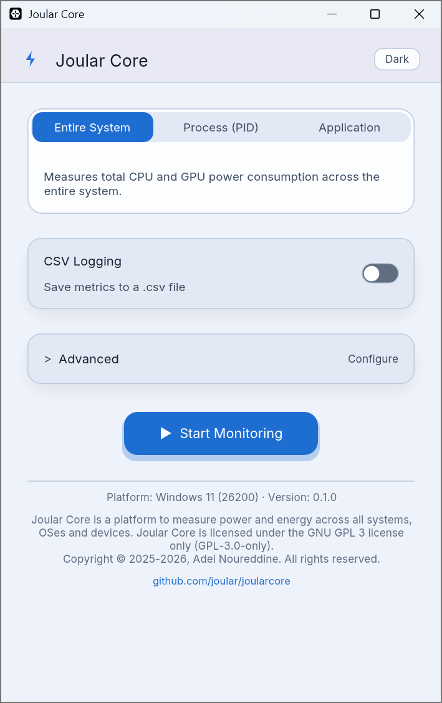
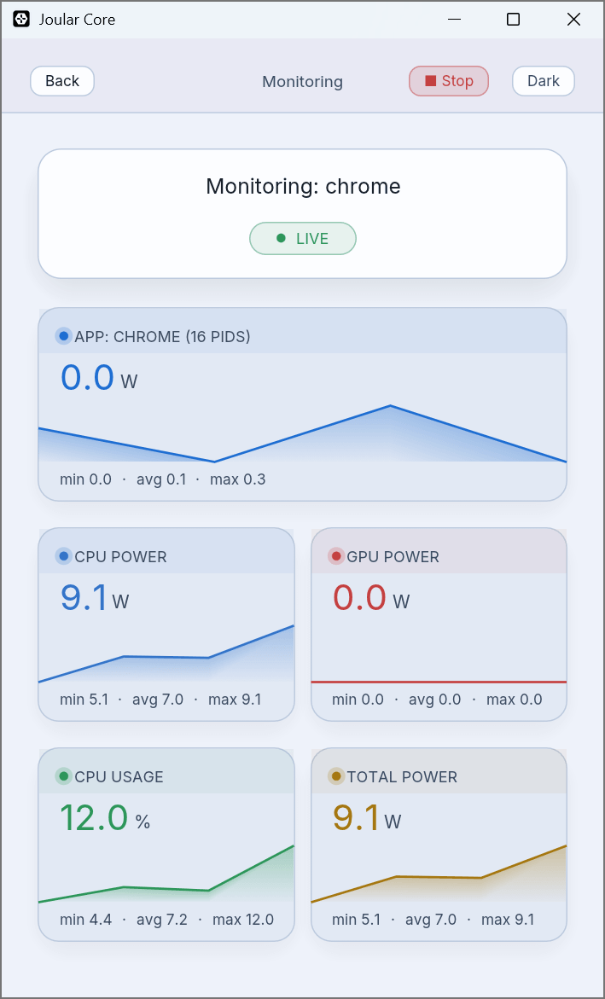
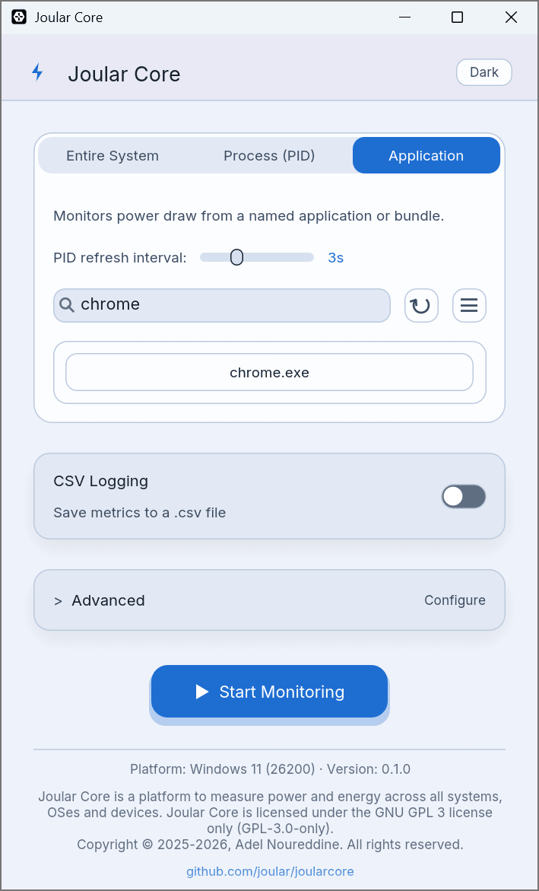
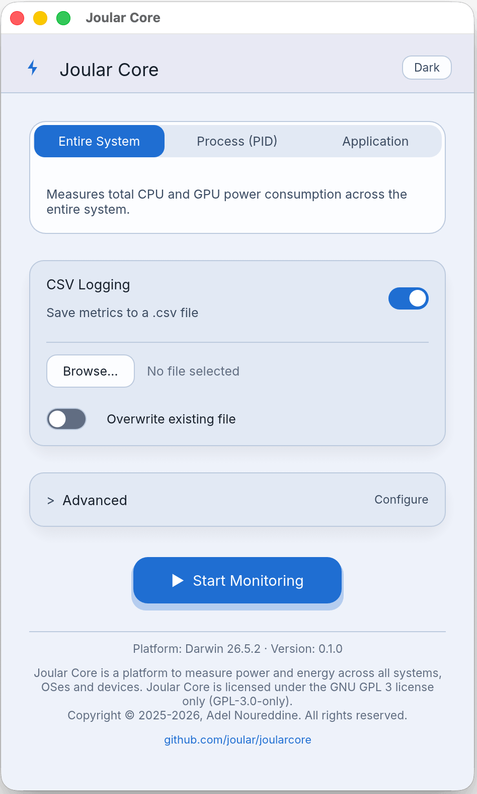
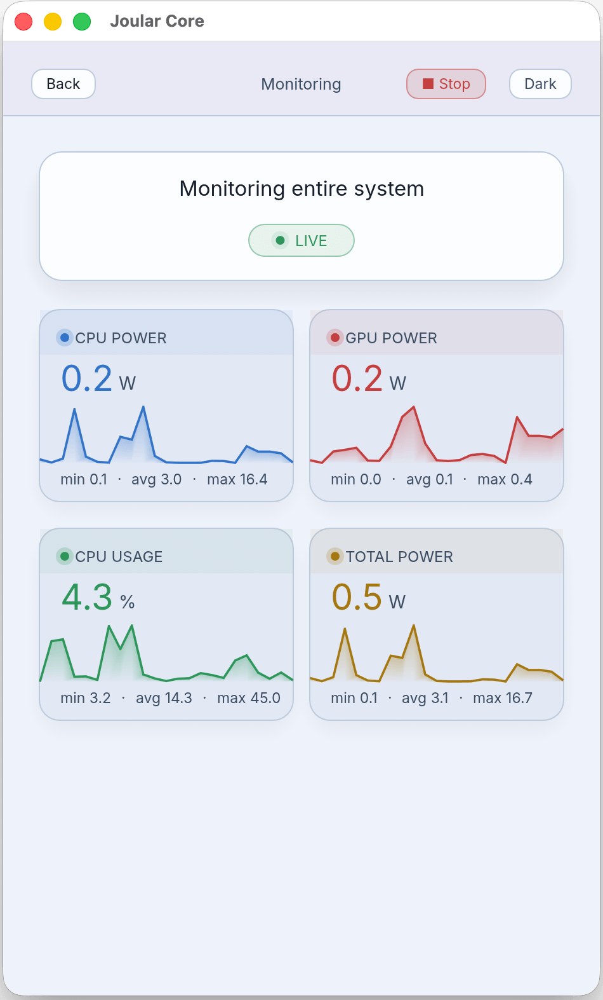
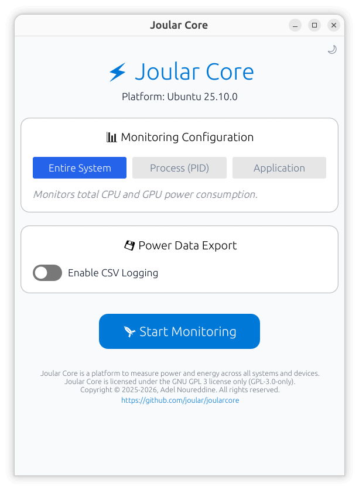
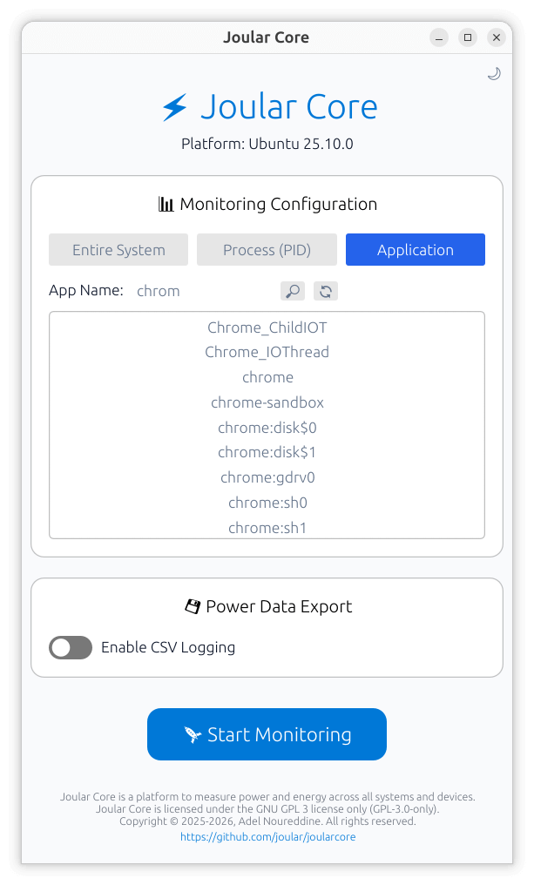
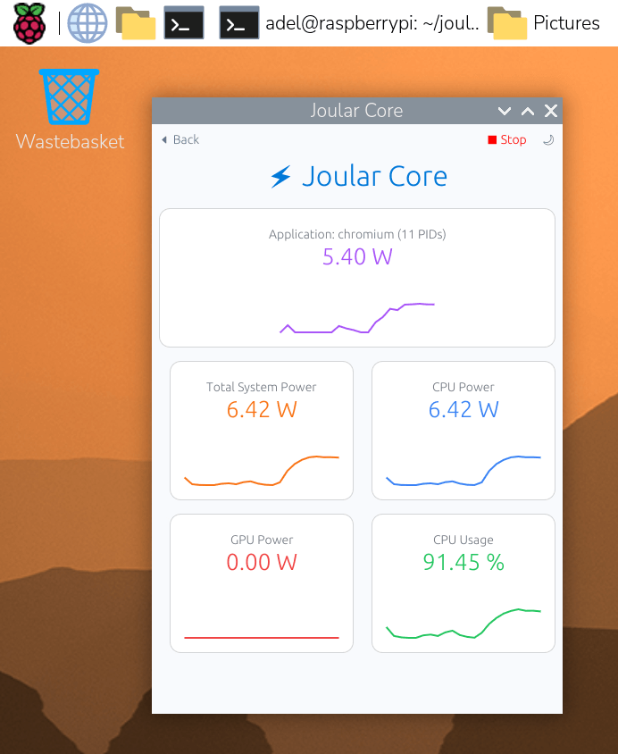
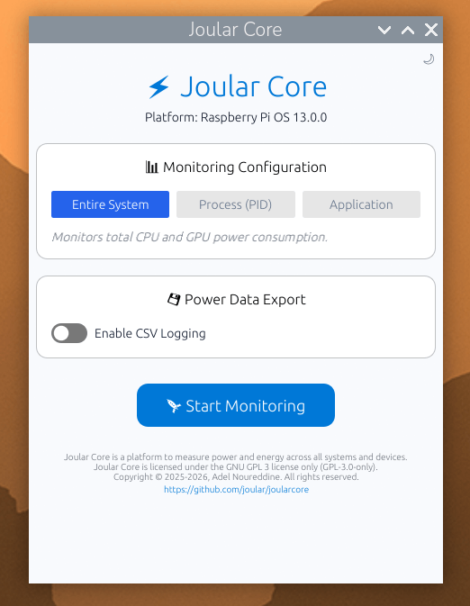

#  Joular Core :zap:

 

This is a graphical program that uses [Joular Core - Rustic](https://github.com/joular/joularcore-rustic) library to monitor energy on all platforms and operating systems.

---

## Screenshots

#### GUI — Windows, macOS, Linux, Raspberry Pi

    

    

    

    

---

## 📜 License

Joular Core GUI is licensed under the GNU General Public License 3 license only (GPL-3.0-only).

Copyright © 2025-2026, Adel Noureddine.
All rights reserved. This program and the accompanying materials are made available under the terms of the [GNU General Public License v3.0 (GPL-3.0-only)](https://www.gnu.org/licenses/gpl-3.0.en.html) which accompanies this distribution.

Author: Prof. Adel Noureddine
